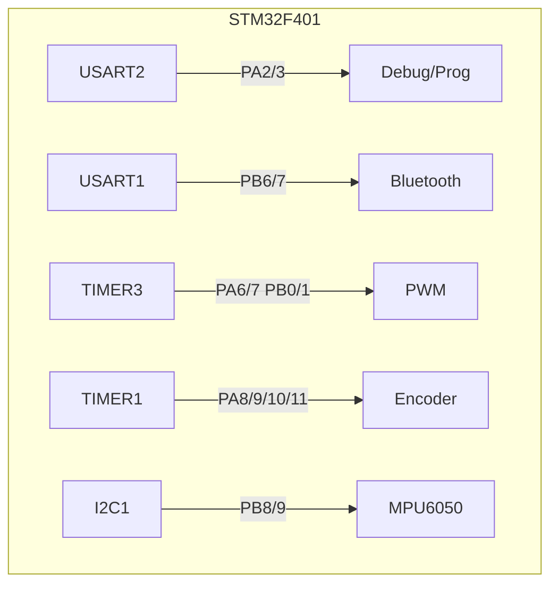

# STM32 Black Pill Connection Diagram

```mermaid
graph TB
  subgraph STM32F401
    USART2 -->|PA2/3| Debug/Prog
    USART1 -->|PB6/7| Bluetooth
    TIMER3 -->|PA6/7 PB0/1| PWM
    TIMER1 -->|PA8/9/10/11| Encoder
    I2C1 --> |PB8/9| MPU6050
  end
```

