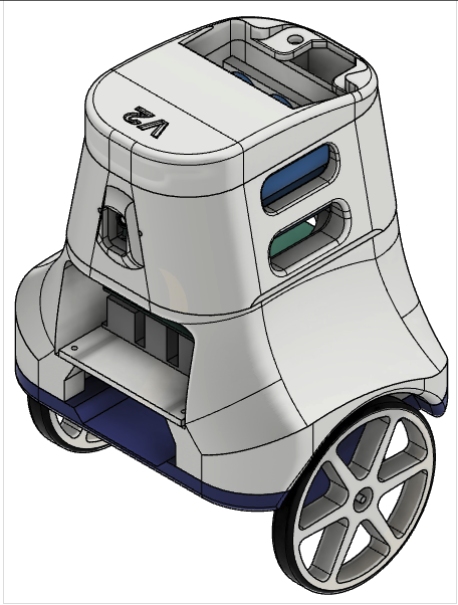
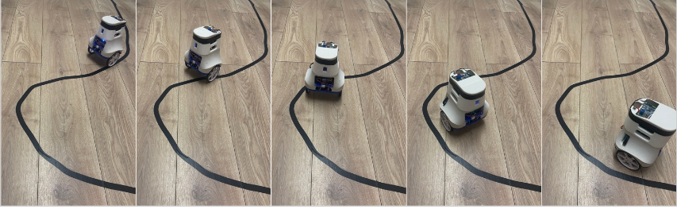
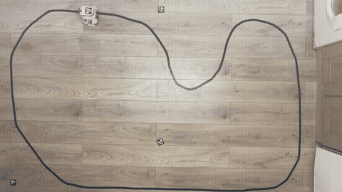

# Two Wheel Self Balancing Mobile Robot

Final Year Capstone Mechatronics Project. 
Designed to be a cost effective platform for research and development of autonomous 
mobile robotics. The non linear and unable dynamics of the Two Wheel Self Balancing Mobile Robot (TWSBMR)
make it a challenging platform for control and navigation.

Low Level motor control implemented on STM32F411RE microcontroller, using LibOpenCM3.
High Level Monocular Navigation uses RaspberryPi 5 with the Pi Camera V3.
[ComsTerm](https://github.com/Wrodders/ComsTerm) used as engineering UI. 

## Design

The project was built around milestones of autonomy:

* Stabilization
* Positional Control
* Teleoperation
* Path Following 
* Path Recovery 
* Track Racing

