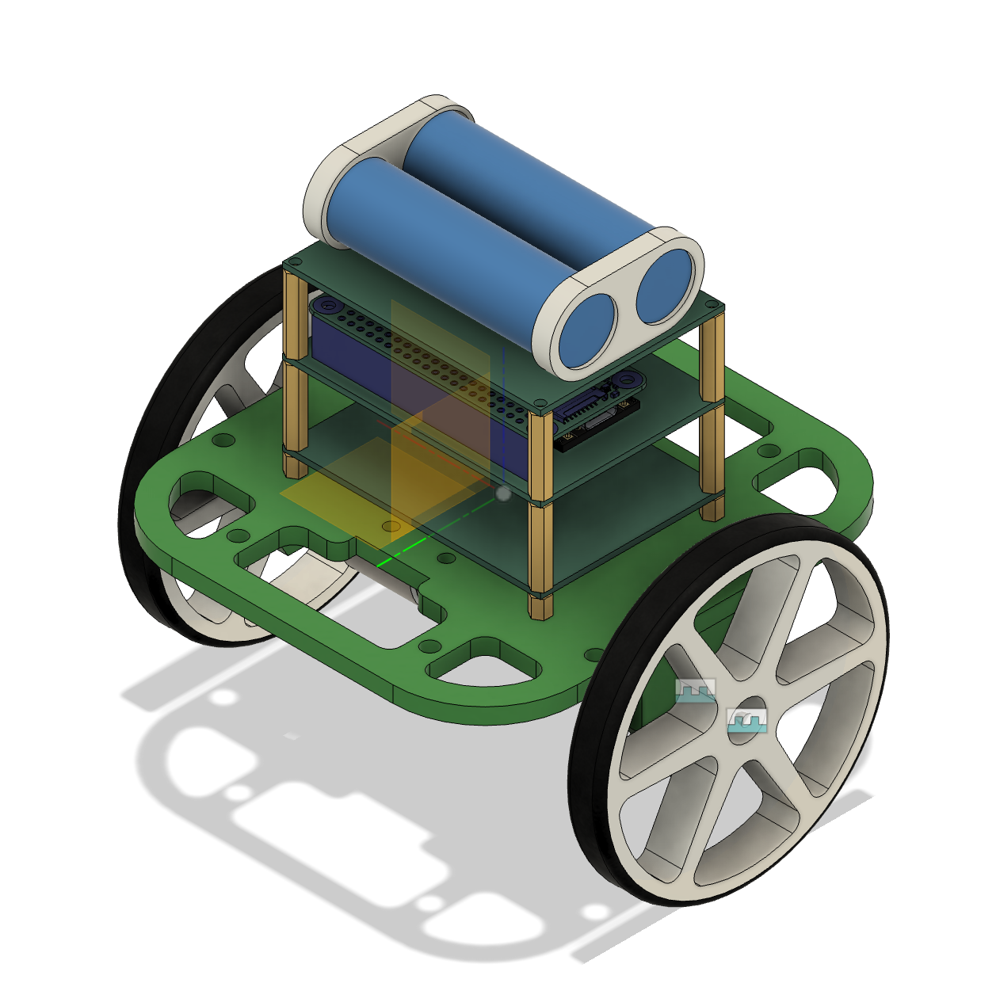
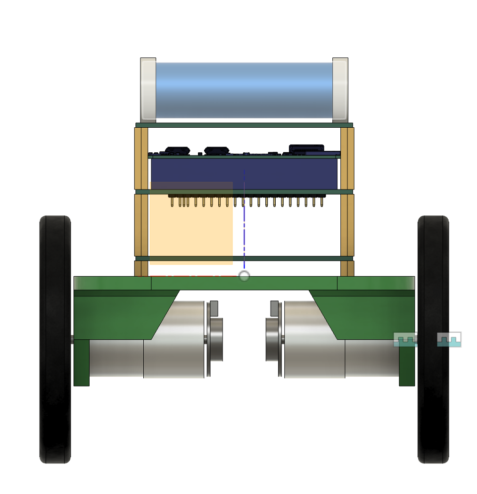
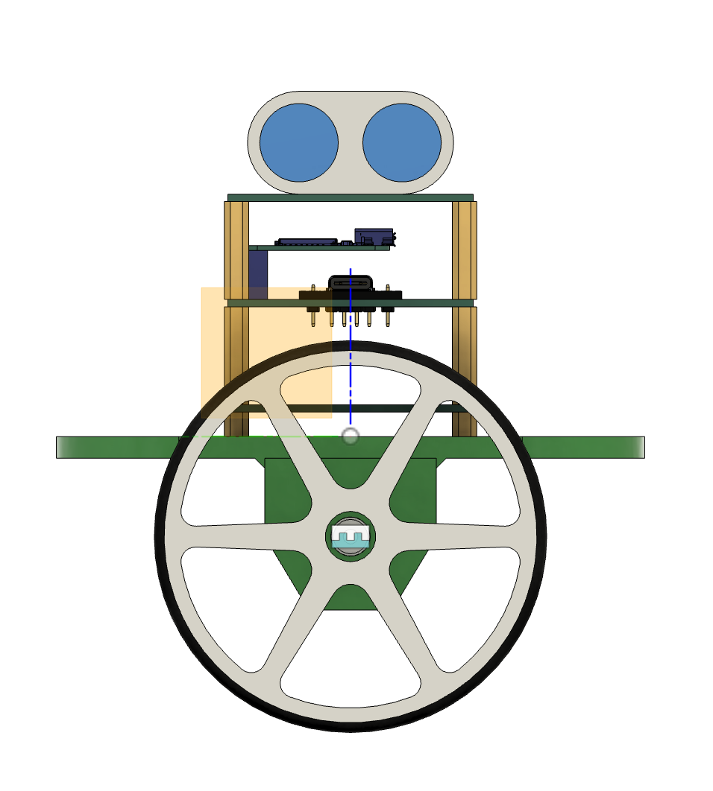
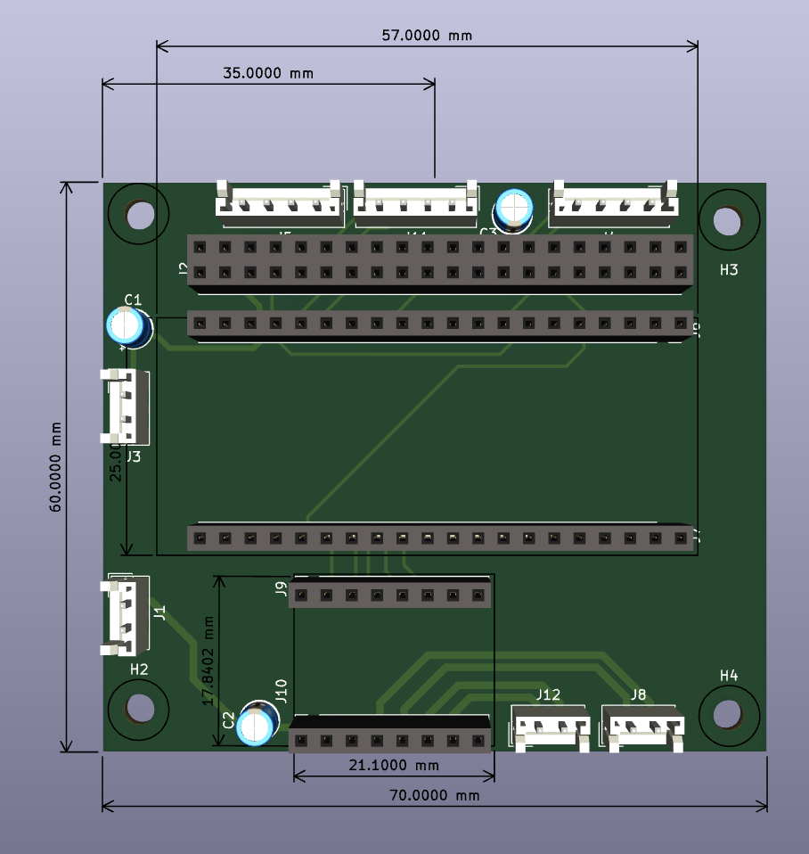
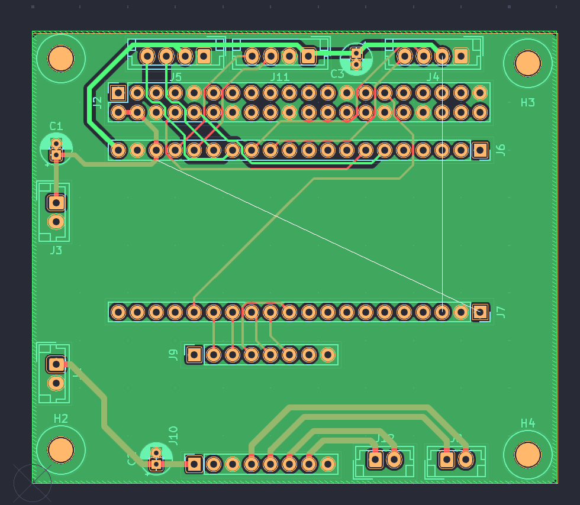
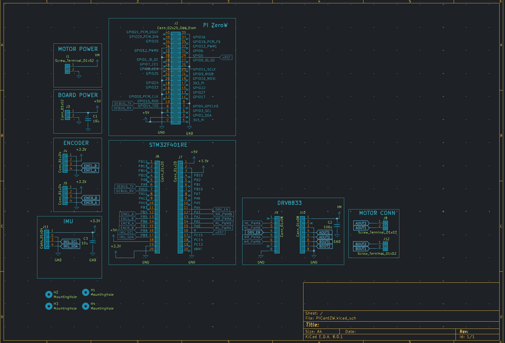

# Two Wheel Self Balancing Mobile Robot

Self Balancing Robot using STM32 and PiZeroW

Firmware Written using BareMetal Registers, Abstracted by device Peripheral Drivers. 

Control & Dynamics Modeled in Matlab

Software Prototyped in Python & Bash, ported to C/C++ when mature & performance demands. 

[ComsTerm](https://github.com/Wrodders/ComsTerm) used as engineering UI. 

## Design

## Electronics

## Control

### Cascaded PID Controller

