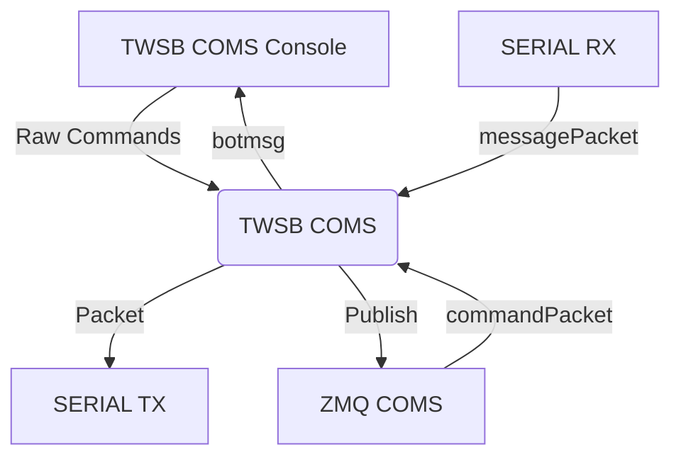
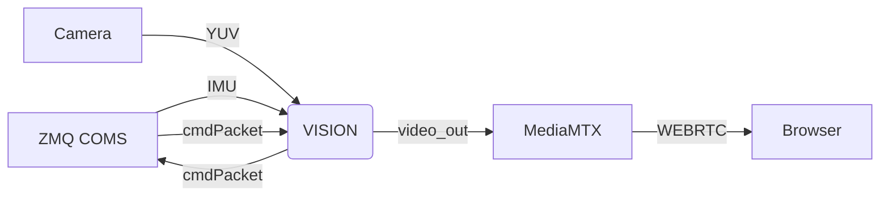

# Software

- [Software](#software)
  - [twsbComs](#twsbcoms)
    - [twsbComs](#twsbcoms-1)
    - [twsbComs Console](#twsbcoms-console)
    - [zmqComs](#zmqcoms)
  - [VISION](#vision)
    - [Vision Based Trajectory Planning](#vision-based-trajectory-planning)
- [Vision Perforamnce Testing](#vision-perforamnce-testing)

## twsbComs

* Publishes Messages to botmsgs under TWSB/
* 
* Processes Commands from botcmds under TWSB/
* Processes Raw Comands from the TWSB Console 


Single Threaded, Event Driven IO Server loop. 

### twsbComs

TWSB Coms, listens for **raw commands** from the TWSB Console, and **command packets** from the ZMQ Subscriber to the TWSB Topic on the ***ipc:///tmp/botcmds*** socket.
It also listens for telemetry messages from the serial port these are used to map the received messages to the appropriate botmsgs topic. ( As the MCU is memory constrained, it sends ascii encoded single byte headers, which are mapped to strings using xMacros in the Firmware/pubrpc/ module.) 

### twsbComs Console

The TWSB Coms Console is a simple command line interface that allows the user to send raw commands to the TWSB Coms module. The raw commands are sent accoding to the protocol. e.g of the form ***'<BC6.8\n'***. The TWSB console is a direct interface to the serial port. The TWSB console also can listen and "subscribe" to the messages as they are parsed by the TWSB Coms module. e.g it can listen to the ***'CMD_RET'*** and ***'IMU'*** messages.
It is primarily used for debugging and testing.

### zmqComs
This is a interface to the IPC networks on the system. It is used to send commands to the microcontroller and receive telemetry messages though the TWSB Coms module. Current Implementation of PUB SUB architecture limits command style messages, command return values are sent as telemetry messages under a specific topic. Future implementantion of a router delaer pattern will allow for more complex command return values.

MessagePacket   | BotMsgs                  |
----------------|---------------------------
<F0.0:0.0:0.0\n | IMU 0.0:0.0:0.0 timestamp

Example of mapping a message packet to a botmsg. 

## VISION

* Reads Images from Camera in YUV format
* Gray scales the image
* Listens for telemetry messagesa from the TWSB, processes IMU data
* Processes the image with filters ect
* Listens for commands on Vision topic, processes commands
* Publishes a trajectory of commands to the TWSB Coms module




### Vision Based Trajectory Planning

*  Calibrate Camera using Zhengs Method
*  Computes Homography Matrix using transform usign IMU data and camera calibration
*  Apply Birds Eye View Perspective Transform to the image
*  Apply Kernal Filters to the image (Sobel || Canny ||)
*  Apply Histogram to determine area of probable interest 
*  Use least squares to fit a line to the threasholded points in the area of interest
*  Generate trajecotry commands using the differential drive kinematics model
*  Trajecotry commands are generated usign a selection of parametrizable algorithms
   *  Pure Pursuit || lateral control + curvature based speed control
*  Inverse Transform the trajectory to the original image space
*  Draw the trajectory on the image in green


# Vision Perforamnce Testing


Pipeline     | Memory | CPU % |
-------------|--------|-------|
libcamera-udp| 42M    | 7.7   |
libcam-mtx   | 


``` mermaid

flowchart LR
    RemoteCLI[Remote CLI Publisher]
    BotCmdsIPC[botcmds IPC Socket]
    Port5556[Localhost:5556]
    
    TWSB[TWSB Service]
    Vision[Vision Service]
    
    CLI[CLI (Port 5555 Receiver)]
    
    %% Remote CLI publishes commands to the port accessible from remote PCs
    RemoteCLI --> Port5556
    
    %% Both services subscribe to commands on the IPC socket with their respective topics
    BotCmdsIPC -- "TWSB commands" --> TWSB
    BotCmdsIPC -- "VISION commands" --> Vision
    
    %% Both services also subscribe to commands on the local 5556 port (by topic)
    Port5556 -- "TWSB topic" --> TWSB
    Port5556 -- "VISION topic" --> Vision
    
    %% Both services send messages to the CLI on port 5555
    TWSB -- "Messages" --> CLI
    Vision -- "Messages" --> CLI
    
    %% TWSB sends additional messages over the ice botmsgs channel, which Vision subscribes to
    TWSB -- "ice botmsgs" --> Vision


```
