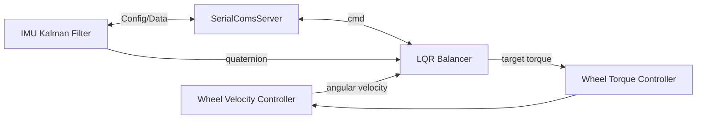
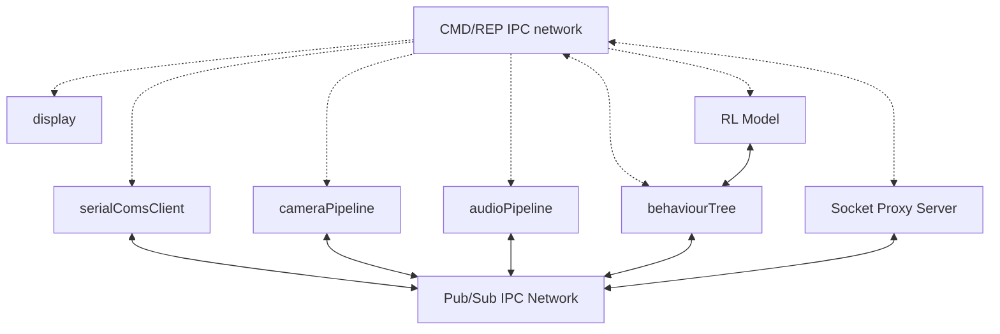
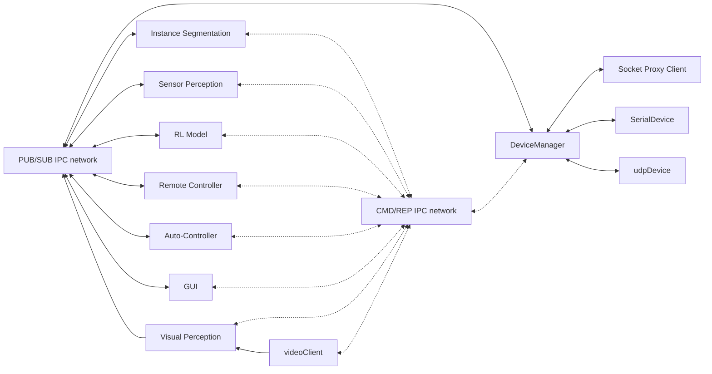

# dBot Software

This code is designed to be used as simulation for eventual running on the raspberry pi zero W. it Interfaces with Devices via AT commands and sends telemetry data over the network to another client (PC). the PC can also send RPC commands to the pi. 

The same code base is used on the PC software and on the PI to avoid compatibility issues. 

## Build

Cmake script builds all,common,pc,raspberry projects, specified by name and dependencies updates. Build files locate din build, executables located in $PROJECT/bin/

## Raspberry
Code That is run on PI Zero W. Gets cross compiled with shared libraries. piUpdate.sh transfers binaries in raspberry/bin/ and scripts in raspberry/scripts.

## PC
Code that runs on the PC. Compiled executables located in pc/bin/.

# Code Architecture

The system is broken down into 4 components; **Self-Balancing Controller**, **Communication Framework**, **Visual Perception**, **Sensor Perception**.

These components execute concurently across 3 different platforms; **STM32F401CCU** Microcrontorler, **RaspberyPi ZeroW** Microprocessor board, **Remote PC**. 

## MCU Firmware

Written in Baremetal C; 
* Polls MPU6050 at 1kHz
* KalmanFilter computes Quaternions 
* LQR takes Quaternions, Angular Velocity Outputs Torque
* Torque controller Cascaded with a closed loop Velocity Controller
* SerialComsServer Handles target set-points and angular/linear velocity commands 

## Pi Software

C/C++
* reads serial port and decodes/encodes messages
* Opens Video camera UDP Client, streams h264 encoded video @720p25Hz
* Runs Socket Proxy Sever, telemetry & RPC 
* Runs onboard microphone speech commands pipeline
* RL model controls behavior tree; sends RPC commands

Only The Server and the Behavior tree can send commands via the CMD/REP IPC Network. This simplifies handling commands.

## Remote PC Software 

C/C++ & pyQT6

Controls multiple Devices, each enumearatign their publishng topics & protocols as well as commands upon connection. 

IPC network handesl communciation between processes via pub/sub topics. 

When the GUI is running direct commands can be sent to any device after enumeration. Otherwise the RL model will output commands as and when requiered for Autonomus tasks. 

